 ***Die Dokumentation***
---
---

## **Einteilung**

### Allgemeine Beschreibung der Aufgabestellung
- In diesem Prakitkum muss man eine Webapplikation, in der man für die Veranstaltung plannen und organiesieren. Durch diese Applikation kann der Mitarbeiter durch ein Raster die Veranstalltungsfläche in jeder Halle einteilen. Und dann kann der Aussteller die Ausstellungsfläche buchen oder stonieren, wenn die Fläche schon vorher gebucht wurde. Die Besucher kann zuerst die Halle auswählen, und dann kann er wissen, wer eine Ausstellungsfläche gebucht hat. Außerdem kann er weitere Informationen zu dem Aussteller erhalten oder die Information zu Halle, Ausstellungsfläche usw suchen.  

### Allgemeine Informationen
- Das ist eine Single-Page Applikation (SPA)
- Frontend: 
	- Javascript, fetchAPI zum asynchronen Datenverkehr zwichen Client und Server
	- HTML
	- CSS (besonders CSS-Grid für Layout und für Halle-Layout)
- Backend: 
	- Python  
	- Cherrypy framework zur Implementierung des Webserve rs mit REST-Interface
- Hilfsmittel:
	- cherrypy zur Implementierung des Webservers mit REST-Interface
	- te/tm zur clientseitigen Verwendung von templates
	- es zur clientseitigen Verwendung des Publish-Subscreiber-Musters
	- fetch-API zum ansychronen Datenverkehr zwischen Client und Server

--- 

## **Nutzungsszenario "Messerveranstalter"**

### Allgemeine Beschreibung
- Als Messerveranstalter kann man hauptsächlich die Veranstaltung plannen und organiesieren. Nach der Anmeldung kommt man zur ein Dashboard, im dem man arbeiten kann
- Zuerst kann man Halle und Ausstellungsfläche anlegen/löschen/ändern. Und dann kann man durch ein Form und ein Raster  die Ausstellungsfläche in jeder Halle einteilen. 
- Besonders kann der Messerveranstalter den Stand der Buchung prüfen. 

### Benutzgruppe "Messerveranstalter": Beschreibung Persona
- Halle anlegen/löschen/ändern
- Ausstellungsfläche anlegen/löschen/ändern
- Ausstellungsfläche einteilen 

### Interaktionsdesign

#### Übersicht Interaktion

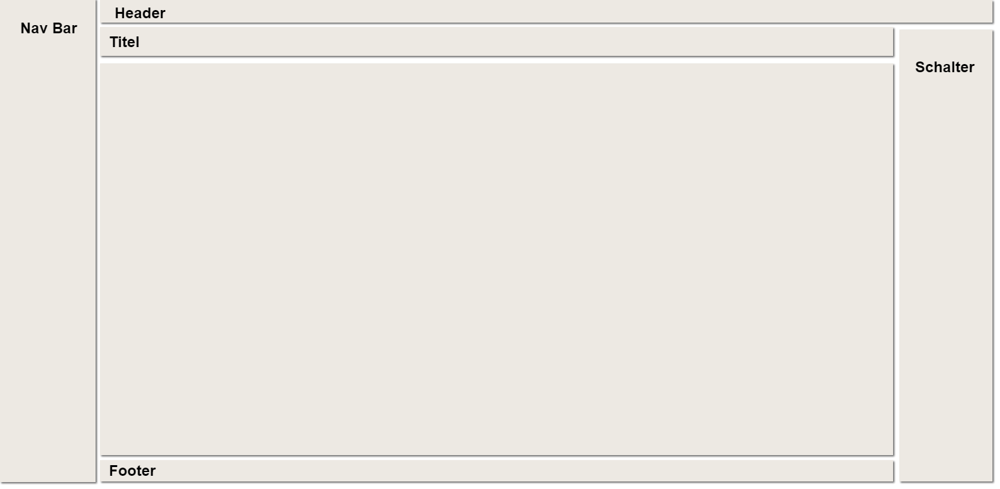

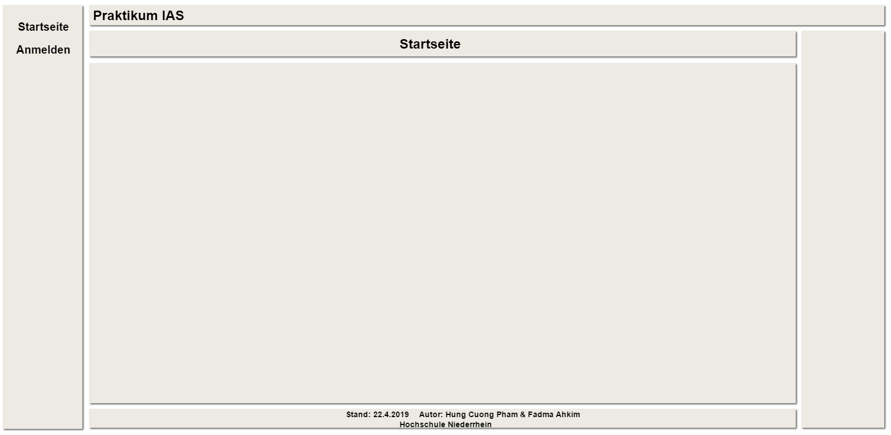

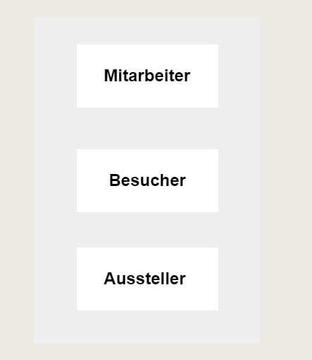

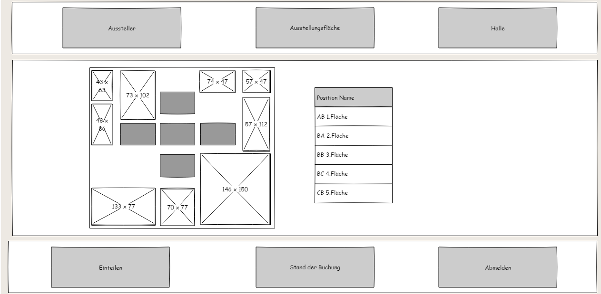

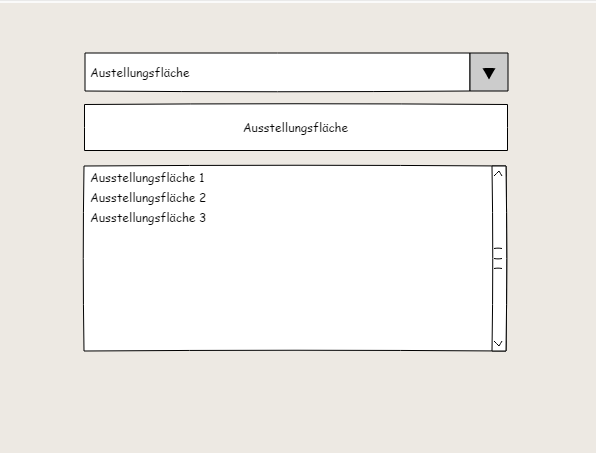

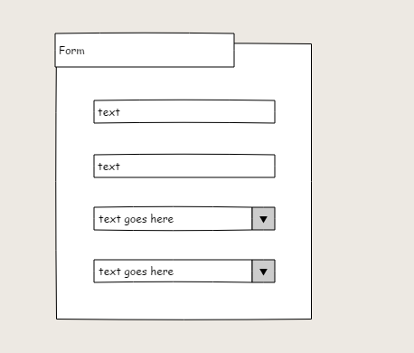

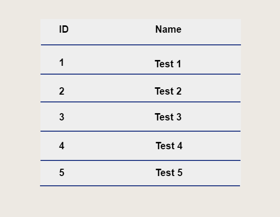

#### Interaktion 1

##### Zustandsdiagramm(e) und Wireframe(s) nach Bedarf 

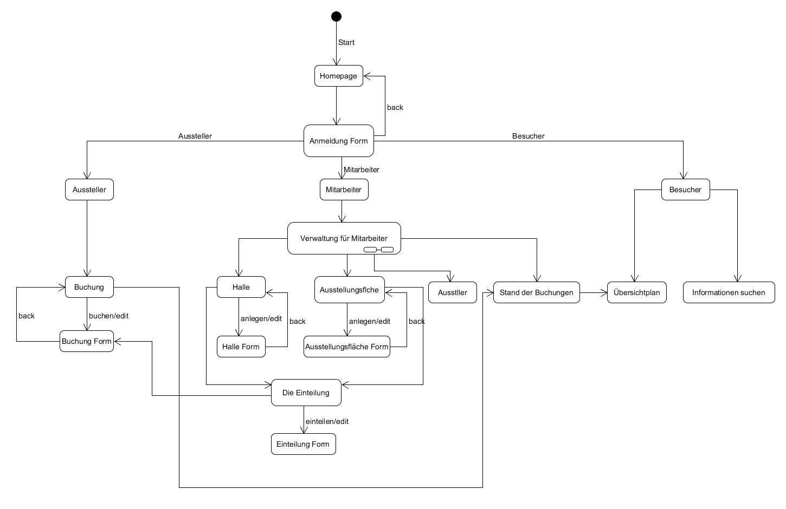

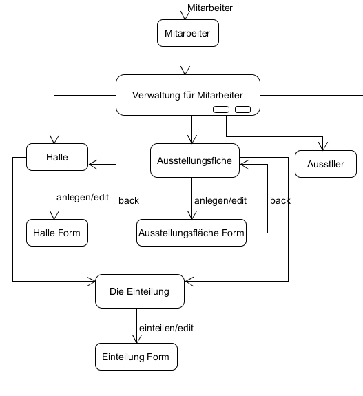

##### Erläuterung
- Nach der Anmeldung kann der Mitarbeiter jetzt arbeiten. Er kann Halle oder Ausstellungsfläche anlegen oder ändern. Vor der Einteilung gibt es Übersichtplan, damit man einfacher einteilen. Und dann durch ein Klick auf  "Einteilung" Schalter kann er mithilfe eines Forms die Ausstellungsfläche in jeder Halle mit einer bestimmter Position einteilen. Es gibt ingesamt 5 Potisionen. Jede Ausstellungsfläche kann nur in eine bestimmte Halle verteilt werden. Außerdem kann man auf die "Stand der Buchung" klicken, dadurch kann man den Stand aller Buchungen prüfen und sehen. 

##### Erläuterung Daten nach Bedarf 
- Daten der Halle (id, Name)
- Daten der Ausstellungsfläche (id, Name)
- Daten der Halleeinteilung (id, Halle_id, Ausstellungsfläche_id, Position, Status)
- Daten für Stand der Buchung (id, Ausstellungsfläche_id, Aussteller_id, Status)

### Test

#### curl-Test

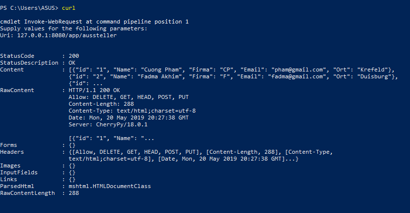

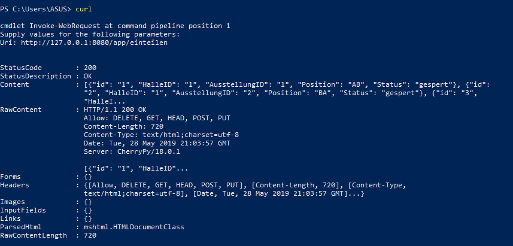

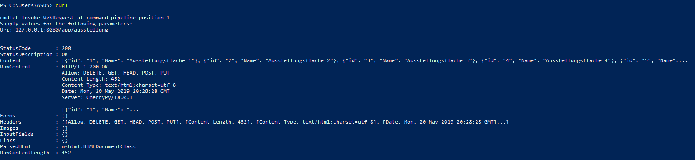

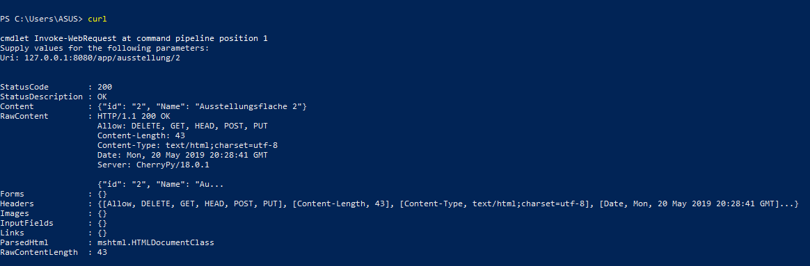

---

## **Nutzungszenario "Aussteller"**

### Allgemeine Beschreibung
- Nach der Anmeldung kann der Aussteller durch einem Form die Ausstellungsfläche buchen. Durch das Raster kann der Aussteller wissen, an welcher Position die Ausstellungsfläche liegt. Außerdem gibt es die Liste aller gebuchte Ausstellungsfläche.
- Der Aussteller kann auch duch einem Form die Buchung stornieren.

### Benutzgruppe "Aussteller": Beschreibung Persona
- Ausstellungsfläche buchen
- die gebuchte Buchung stornieren
- weitere Informationen suchen

### Interaktionsdesign

#### Übersicht Interaktion

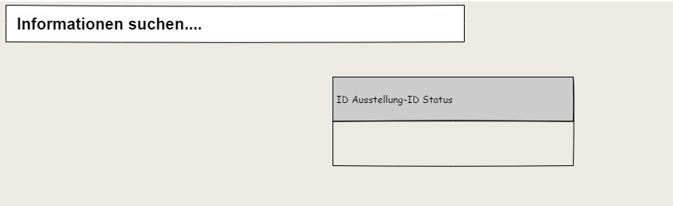

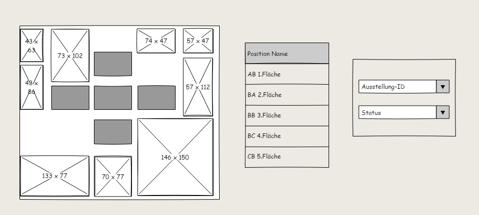

#### Interaktion 1

##### Zustandsdiagramm(e) und Wireframe(s) nach Bedarf 

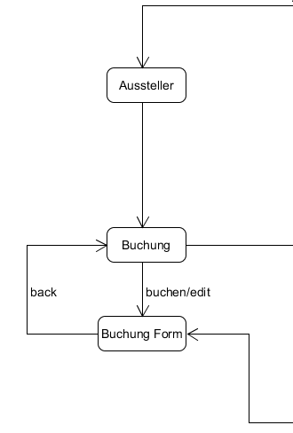

##### Erläuterung
- Nach der Anmeldung kann der Aussteller jetzt die Aussellungsfläche buchen. Vor der Buchung kann man den Stand der Buchung prüfen, indem man auf dem "Einteilen" Schalter klickt. Man kann auch die gebuchten Ausstellungsflächen stornieren. 

##### Erläuterung Daten nach Bedarf 
- Daten des Ausstellers (id, Name, Firma, Email, Ort)
- Daten der Buchung (id, Aussteller_id, Ausstellungsfläche_id, Status)

### Test

#### curl-Test

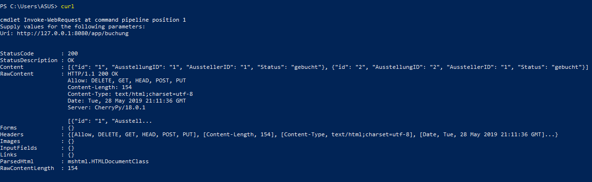

---

## **Nutzungszenario "Besucher"**

### Allgemeine Beschreibung
- Nach der Anmeldung kann der Besucher die Informationen suchen. Zum beispiel um die Information zu Ausstellungsfläche  zu suchen kann er einfach die Halle auswählen und dann wählt man durch den Button die Ausstellungsfläche aus, um zu wissen, welchem Aussteller die Ausstellungsfläche gehört. 
- Außerdem kann der Besucher weitere Informationen zu Hallen, Ausstellungsflächen, Ausstellern,. usw suchen

### Benutzgruppe "Besucher": Beschreibung Persona
- den Übersichtplan für jede Halle abrufen und weitere Informationen zu Ausstellern abrufen
- weitere Informationen zu Hallen, Ausstellungsflächen, Aussteller, usw abrufen

### Interaktionsdesign

#### Übersicht Interaktion

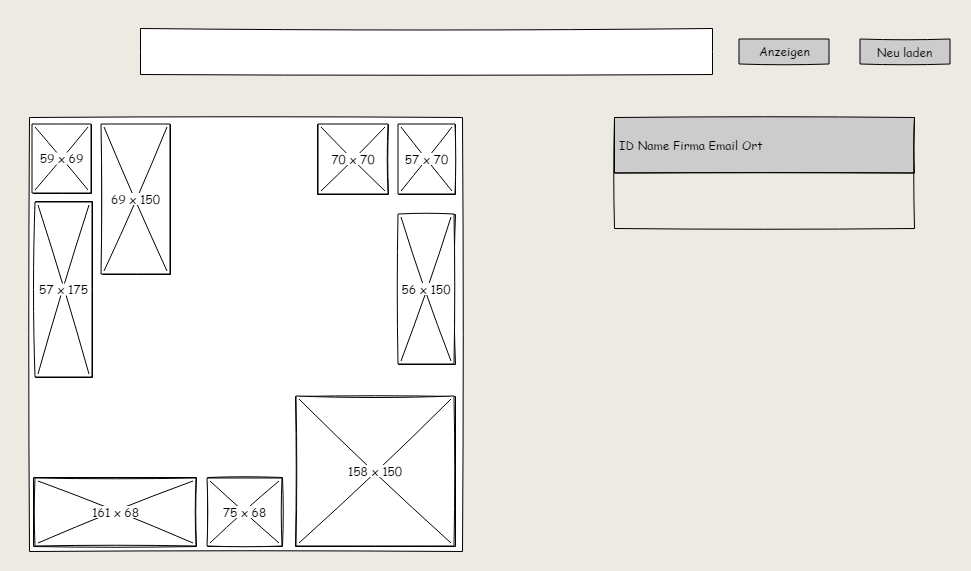

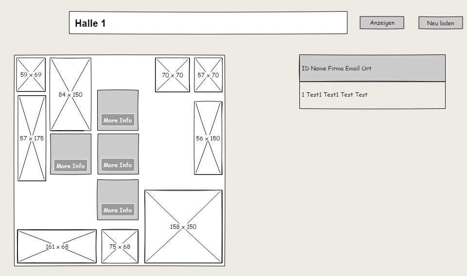

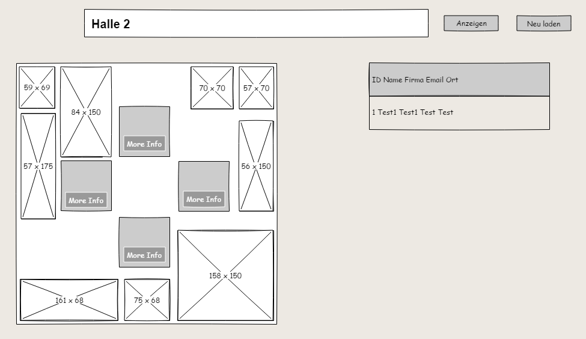

#### Interaktion 1

##### Zustandsdiagramm(e) und Wireframe(s) nach Bedarf 

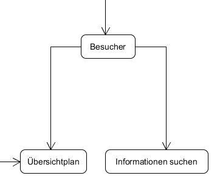

##### Erläuterung
- Nach der Anmeldung kann der Busucher jetz die Informationen zu Halle und Ausstellern. Für die Suche muss man zuerst die Halle auswählen. Und dann entstehen alle Ausstellungsflächen der ausgewählte Halle mit roter Farbe. In jeder Ausstellungsfläche kann man auch Informationen zu dem Aussteller, der die Ausstellungsfläche gebucht hat. Um das zu machen klickt man auf dem "More Info" Schalter. Alle Informationen von dem Aussteller werdem in der Tablle neben dem Übersichtplan entstehen. Wenn man die andere Halle auswählen möchte, muss man zuerst auf dem "Aktualisieren" Schalter klicken und dann kann man andere Halle auswählen.
- Außerdem kann man schnell die Informationen suchen, wenn man "Search auswählen". Zuerst muss man dem Typ der Informationen auswählen 
(zum Beispiel Halle, Ausstellungsfläche, usw), dann kann man die Informationen suchen

##### Erläuterung Daten nach Bedarf 
-  Daten des Ausstellers (id, Name, Firma, Email, Ort)

### Test

#### curl-Test

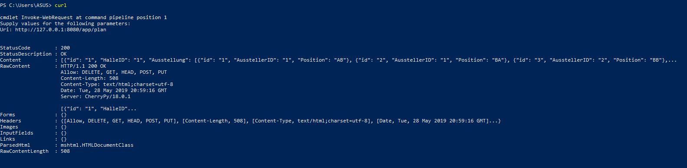

---
---

